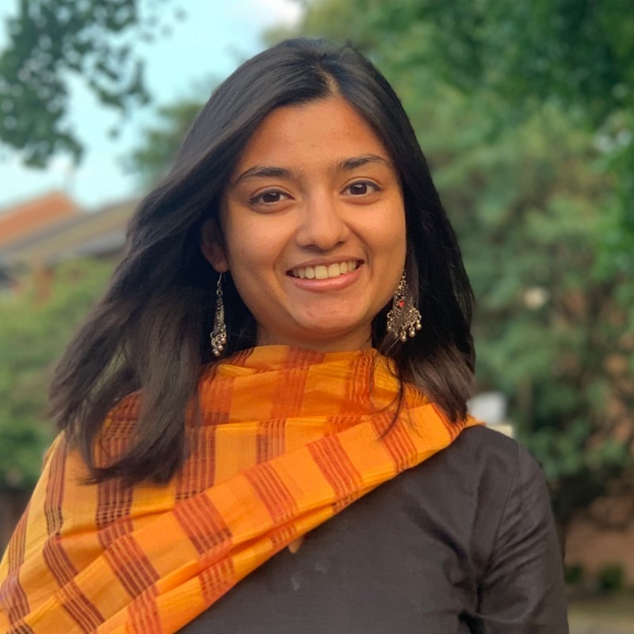

PhD Candidate in Economics

Georgetown University

 

I'm a PhD Candidate in Economics at Georgetown University. My work focuses on Environmental Economics, Development Economics, and Agricultural Economics. Previously, I have worked as a Consultant at the Africa Chief Economists’ Office, World Bank, Robert S McNamara Fellow at the Development Research Group, World Bank, and as a Research Associate at J-PAL South Asia.
</img>

 

#### Research Areas:

* Environmental Economics
* Development Economics
* Agricultural Economics

Contact: [bs1088@georgetown.edu](bs1088@georgetown.edu)